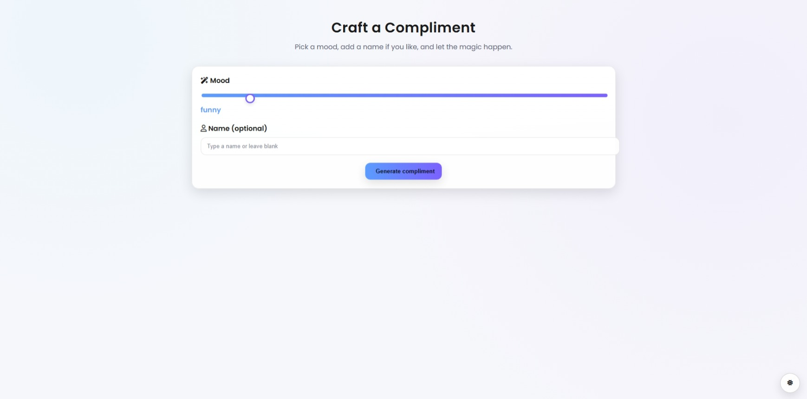
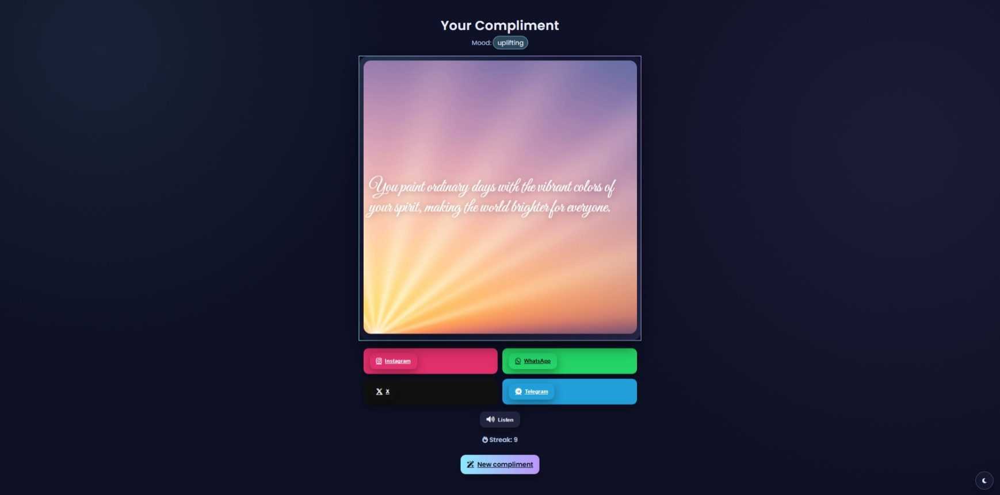

# 🌟 Compliment Generator

A Flask-based web app that generates **personalized compliments** with matching **AI-generated background art** and optional **text-to-speech (TTS)** playback.

Live Demo: 👉 [compliment-generator-six.vercel.app](https://compliment-generator-six.vercel.app/)  
Source Code: 🛠️ [GitHub – TheTechTiger/ComplimentGenerator](https://github.com/TheTechTiger/ComplimentGenerator/)

---

## 🖼️ Preview

### 🏠 Home Page


### 💬 Compliment Display


---

## ✨ Features

- 🎨 AI-generated compliments based on mood and name
- 🖌️ Mood-matching background art (no text overlays)
- 🔊 Text-to-speech playback using neural voices
- 🗃️ SQLite-based compliment storage
- 🔗 Shareable compliment URLs
- 🚀 Vercel-compatible deployment

---

## 🛠️ Tech Stack

- **Backend:** Python 3, Flask
- **Database:** SQLite (stored in `/tmp` for Vercel)
- **AI APIs:** [A4F API](https://api.a4f.co/) for text + image generation
- **TTS:** [edge-tts](https://pypi.org/project/edge-tts/) (Microsoft neural voices)
- **Frontend:** HTML + Jinja2 templates

---

## 📂 Project Structure

```
.
├── app.py              # Main Flask app
├── templates/
│   ├── index.html      # Home page with form
│   └── view.html       # Compliment display page
├── images/
│   ├── index.jpeg      # Screenshot of home page
│   └── compliment.jpeg # Screenshot of compliment view
├── compliments.db      # SQLite database (local dev)
├── requirements.txt    # Python dependencies
└── .env                # API keys and secrets
```

---

## ⚙️ Setup & Installation

### 1️⃣ Clone the Repository
```bash
git clone https://github.com/TheTechTiger/ComplimentGenerator.git
cd ComplimentGenerator
```

### 2️⃣ Create a Virtual Environment
```bash
python3 -m venv venv
source venv/bin/activate   # macOS/Linux
venv\Scripts\activate      # Windows
```

### 3️⃣ Install Dependencies
```bash
pip install -r requirements.txt
```

### 4️⃣ Configure Environment Variables
Create a `.env` file in the project root:
```env
A4F_API_KEY=your_a4f_api_key_here
```

> Alternatively, set `A4F_API_KEY` in your system environment variables.

### 5️⃣ Run Locally
```bash
python app.py
```
Visit: **http://localhost:8000**

---

## 🚀 Deployment on Vercel

This app is configured to run on **Vercel** with Python serverless functions.

- SQLite DB is stored in `/tmp/compliments.db` for compatibility.
- Set `A4F_API_KEY` in Vercel’s environment variables.
- Deploy via:
```bash
vercel --prod
```

---

## 🔗 API Endpoints

### `GET /`
Home page with compliment form.

### `POST /generate`
Generates a compliment + image and stores it in the DB.  
**Request JSON:**
```json
{
  "name": "Akhilesh",
  "mood": "uplifting"
}
```
**Response JSON:**
```json
{
  "ok": true,
  "redirect_url": "/view/<compliment_id>"
}
```

### `GET /view/<compliment_id>`
Renders the compliment page.

### `GET /image/<compliment_id>`
Returns the compliment’s background image (`image/png`).

### `POST /tts`
Generates TTS audio for a compliment.  
**Request JSON:**
```json
{
  "compliment_id": "abc123",
  "voice": "en-US-AriaNeural",
  "rate": "+0%",
  "pitch": "+0Hz"
}
```
**Response:** MP3 audio stream.

---

## 🎨 Mood Styles

| Mood         | Style Description |
|--------------|-------------------|
| uplifting    | Soft sunrise gradients, airy bokeh |
| funny        | Bold pop-art, playful doodles |
| poetic       | Ink-wash textures, muted tones |
| motivational | Geometric lines, energetic hues |
| romantic     | Warm tones, floral motifs |
| witty        | Neon accents, quirky contrasts |
| gentle       | Calming blues, watercolor blends |
| bold         | Sharp lines, deep shadows |
| quirky       | Hand-drawn motifs, surprising colors |
| serene       | Misty gradients, cool palette |

---

## 🗝️ Environment Variables

| Variable     | Description |
|--------------|-------------|
| `A4F_API_KEY`| API key for A4F text & image generation |

---

## 📜 License

MIT License – feel free to fork, modify, and share.

---

## 💡 Author

Built by **[TheTechTiger](https://github.com/TheTechTiger)**  
Live at **[compliment-generator-six.vercel.app](https://compliment-generator-six.vercel.app/)**

---

---

Let me know if you’d like to add badges (build status, license, etc.), a demo video, or usage GIFs. I can also help write a short blog-style intro for the repo if you're planning to share it on social platforms.
